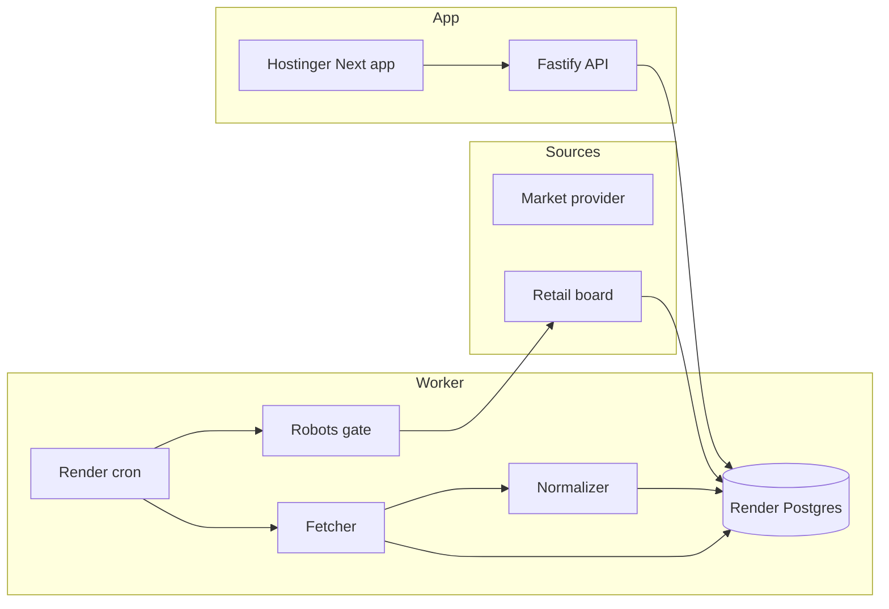
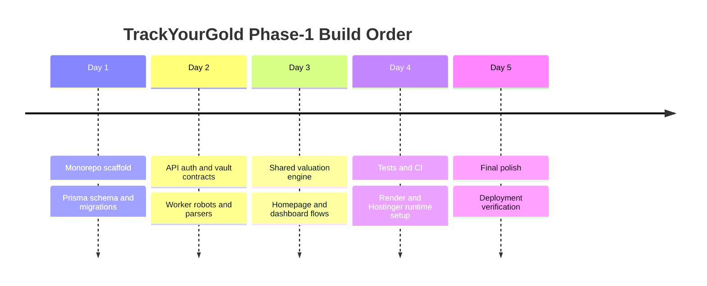

# TrackYourGold Phase-1 MVP

TrackYourGold helps users in Qatar and the GCC track what their gold is worth today, piece by piece. The product is built around personal vaults, item-level entries for jewelry, coins, bars, and scrap, and clean daily value snapshots in QAR so users can see current value, invested amount, and profit or loss without spreadsheet work.

Phase-1 uses one market data provider and one compliant retail source. Market rates come from a provider adapter built for Metals API first, with a compatible interface for future provider swaps. Retail rates come from a single Malabar Qatar page parser that checks robots rules first, caches robots responses, rate-limits retail fetches aggressively, and stores raw snapshots before parsing so every ingest run can be audited.

The architecture is a monorepo split across a Hostinger web frontend and Render backend services. Hostinger serves the Next.js web app only. Render runs the Fastify API, the background ingestion jobs, and the Postgres database. The worker continues ingesting and publishing rates even when nobody is visiting the site, and the API contracts are designed to be reused by a future mobile app.

## How Valuation Works

- `purityFactor = karat / 24`
- `net_gold_weight_g = max(gross_weight_g - stone_weight_g, 0)`
- `intrinsic_value = net_gold_weight_g * market_rate_for_item_karat`
- `retail_value = net_gold_weight_g * retail_rate_for_item_karat`
- `sell_estimate = intrinsic_value * (1 - sell_spread_pct)`
- `profit_loss = current_value - purchase_total_price_qar`

All stored and displayed Phase-1 valuations are QAR-based. Retail-derived rates may use 24K as the source and derive lower karats when the retail board does not publish every karat. Estimates are informational and may vary by buyer, deductions, and local market conditions.

## Wireframe Descriptions

- Landing: a premium dark landing page with the latest Qatar 22K price as the hero, a compact trend view, and three supporting product cards for vaulting, clarity, and compliance.
- Signup and Login: centered card forms with minimal friction and immediate redirect into the personal vault flow.
- Dashboard: top-level cards for total value, invested amount, and profit or loss, followed by the latest tracked items with direct drill-in links.
- Vault List: a list of user vaults on one side and a simple create-vault form on the other.
- Add Item: a focused form for item name, category, karat, weights, purchase date, purchase total, and optional purchase details.
- Item Detail: editable item fields on one side and a small snapshot panel on the other with the item purchase context.
- Sources Status: simple source health rows showing stale state, failure counts, and latest error text.

## Data Flow

## Timeline

## Workspace Layout

- `apps/web`: Next.js App Router frontend for Hostinger
- `apps/api`: Fastify API for Render
- `apps/worker`: ingestion and normalization jobs for Render
- `packages/db`: Prisma schema, client, migrations, and seed
- `packages/shared`: shared schemas, types, constants, and valuation math
- `fixtures`: retail HTML fixture for parser tests

## Environment Variables

Set these values before local or hosted runs:

- Global:
  - `APP_ENV`
  - `APP_DEFAULT_CURRENCY`
  - `APP_DEFAULT_LOCALE`
  - `DATABASE_URL`
  - `DIRECT_URL`
- Web:
  - `API_BASE_URL`
  - `COOKIE_DOMAIN`
  - `WEB_APP_HOST`
- API:
  - `JWT_ACCESS_SECRET`
  - `JWT_REFRESH_SECRET`
  - `ACCESS_TOKEN_TTL_MINUTES`
  - `REFRESH_TOKEN_TTL_DAYS`
  - `VALUATION_CACHE_TTL_SECONDS`
- Worker:
  - `MARKET_API_PROVIDER`
  - `MARKET_API_BASE_URL`
  - `MARKET_API_KEY`
  - `MARKET_API_TIMEOUT_MS`
  - `MARKET_INGEST_EVERY_MINUTES`
  - `RETAIL_INGEST_EVERY_MINUTES`
  - `RETAIL_MALABAR_HOST`
  - `RETAIL_MALABAR_PATH`
  - `RETAIL_RATE_LIMIT_PER_MINUTE`
  - `ROBOTS_CACHE_TTL_HOURS`
  - `ALERT_WEBHOOK_URL`
  - `ALERT_MIN_SEVERITY`

## Local Development

1. `npm install`
2. `npm run db:generate`
3. Apply the migration in `packages/db/prisma/migrations/202603180001_init`
4. `npm run db:seed`
5. `npm run dev`

Useful direct commands:

- `npm run build`
- `npm run build:all`
- `npm run start`
- `npm run lint`
- `npm run typecheck`
- `npm test`
- `npm run worker:ingest:all`
- `npm run worker:daemon`

## Source Registry

| Site | Type | Karats | Update freq | Scraping risk | Confidence |
| --- | --- | --- | --- | --- | --- |
| Metals API | api | 24, 23, 22, 21, 18, 14, 12, 10, 9, 8 | 10 min default | low | high |
| Malabar Gold and Diamonds | retail_html | 24, 22, derived lower karats | 15 min default | medium | medium |

## Deployment Checklist

### Render

1. Use the existing Frankfurt Render Postgres instance.
2. Apply the Prisma migration and run the seed script.
3. Create the API service from `render.yaml`.
4. Create the ingest cron job from `render.yaml`.
5. Set all worker and API environment variables.
6. Trigger one manual ingest run.
7. Confirm `price_snapshots_raw`, `raw_snapshot_blobs`, `prices_normalized`, `ingest_runs`, and `source_health` receive data.

### Hostinger

1. Point the Node app at `apps/web`.
2. Use the repo root for install/build/start.
3. Build with `npm install && npm run build`.
4. Start the standalone server with `npm run start`.
5. Set only frontend-safe values on Hostinger, especially `API_BASE_URL`, `COOKIE_DOMAIN`, and defaults.
6. Confirm the homepage renders even if Hostinger has no direct database access.

## Post-Deploy Verification

1. Create an account.
2. Log in.
3. Create a vault.
4. Add a sample 22K item at 10g with a purchase total of 5000 QAR.
5. Confirm the dashboard shows total value, invested amount, and profit or loss.
6. Confirm the landing page hero shows the latest 22K Qatar price.
7. Confirm source status shows the market and retail rows.
8. Confirm raw snapshot rows exist before normalized price rows for each source.

## Monitoring and Alerts

- The worker writes an `ingest_runs` row for every run.
- `source_health` tracks stale state, consecutive failures, and latest error.
- If `ALERT_WEBHOOK_URL` is empty, alerts log only.
- Market source stale beyond 30 minutes is treated as error severity.
- Retail source stale beyond 6 hours is treated as warn severity.
- Three consecutive failures trigger an alert event.

## Time and Cost Estimate

- Expected Phase-1 build effort for one strong full-stack engineer: 40 to 70 hours.
- Hostinger web hosting cost: existing plan.
- Render Postgres: starts low for testing, should be upgraded before real production use.
- Render API and cron cost: low to moderate depending on service tier and frequency.
- Market API cost: plan-dependent, so ingest cadence stays configurable.
